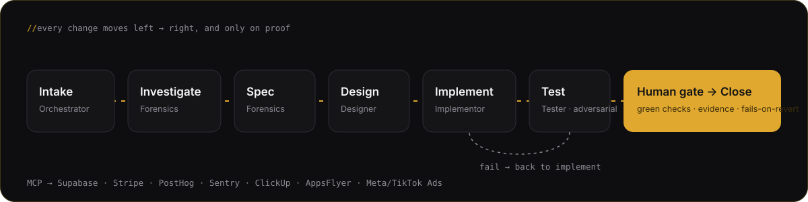
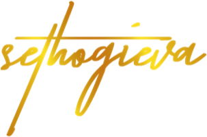

<a href="https://sethogieva.com">
  
</a>

<p align="center">
  <a href="https://sethogieva.com"></a>
  <a href="https://www.linkedin.com/in/ogievaseth/"></a>
  <a href="https://medium.com/@ogievaseth"></a>
  <a href="https://somethingelse.live"></a>
  <a href="https://ratings.fide.com/profile/8509182"></a>
</p>

---

### `whoami`

I take **AI products from zero to market** — and run the **AI-native team** that ships them.

Engineer by training, product leader by trade, go-to-market by instinct. 8+ years across AI/ML, SaaS, B2C, B2B and B2G — from a $30M construction ops portal to defence-grade enterprise software to a 0→1 consumer AI app.

```ts
const seth = {
  role:      "Senior Product Leader @ Mingla",
  shipping:  ["Mingla Explorer (iOS + Android)", "Mingla Host (iOS + Android)"],
  markets:   ["UK", "US", "Nigeria"],
  payments:  ["Stripe", "Paystack"],
  operating: "multi-agent delivery on Claude Code + MCP, humans at every gate",
  owns:      ["roadmap", "specs & data models", "in-product adoption", "GTM", "growth"],
  basedIn:   ["Raleigh, NC", "Brussels, BE"],
  offClock:  { chess: "FIDE blitz peak 1974", travel: "41 cities, 18 countries" },
};
```

### What I'm building

| Project | What it is |
|---|---|
| **[Mingla](https://sethogieva.com/work/mingla)** | The decision & commerce layer for real-world experiences. A consumer app that turns *“what should we do?”* into an agreed plan, and a business app that helps venues get discovered, booked and paid. Two production apps, live payments in three markets. |
| **[The AI-native delivery pipeline](https://sethogieva.com/work/ai-native-delivery)** | Six specialised agents — orchestrator, forensics, designer, implementor, tester, product — running a gated pipeline. A lean team shipping at full-squad velocity. Packaged as a transferable Engineering Blueprint. |
| **[Somethingelse](https://somethingelse.live)** | My embedded product & growth studio. Migrating client businesses from legacy WordPress to modern Next.js + Vercel stacks — commerce, bookings and CMS — through the same pipeline. |

### How I ship



**Rules the pipeline enforces:** the board is the single source of truth · worktree per work item · every fix ships with a test that fails when the fix is reverted · never merge on red · no fabricated data.

### Track record

| Where | What moved |
|---|---|
| **Mingla** · 2025 → | 0→1 roadmap, 2 production apps, live Stripe + Paystack in UK/US/NG, ~20% faster feature turnaround |
| **ILIAS Solutions** · 2022–24 | Owned product marketing *inside* the product — adoption screens, coachmarks, in-app guidance — plus GTM: **+35% pipeline, −25% sales cycle, +40% enablement usage** |
| **Blue Orb** · 2024–25 | Product narrative behind a **$12M raise**; real-time funnel analytics |
| **Somethingelse** · 2020–22 | Growth for NATO & EU Green Deal programmes (**+45% participation**) and Niyo brands (**+35% acquisition**) |
| **Costain West Africa** · 2017–20 | Site inventory & ops portal across **$30M programmes**, 18% faster delivery |

### Stack

<p>
  
</p>
<p>
  
  
  
  
  
  
  
  
  
</p>

### Writing

<ul>
<!-- BLOG-POST-LIST:START --><li><a href="https://medium.com/@ogievaseth/from-token-costs-to-roi-eb9c23855326?source=rss-c2478155f6f3------2">From Token Costs to ROI: A Product Manager’s Playbook for Profitable AI Features</a> <sub>· Jan 2026</sub></li>
<li><a href="https://medium.com/@ogievaseth/who-i-help-what-i-do-and-why-its-different-77f8995eec70?source=rss-c2478155f6f3------2">Productizing a Service: How I Designed Somethingelse Like a Product</a> <sub>· Jul 2025</sub></li>
<li><a href="https://medium.com/@ogievaseth/pioneering-product-marketing-for-ilias-defense-suite-driving-growth-and-innovation-c22c2f56ac42?source=rss-c2478155f6f3------2">Product Marketing Inside the Product: How I Drove Adoption of the ILIAS Defense Suite</a> <sub>· Mar 2025</sub></li>
<li><a href="https://medium.com/@ogievaseth/the-one-man-agency-how-i-bring-a-marketing-dream-team-to-drive-b2b-saas-growth-f278defab530?source=rss-c2478155f6f3------2">Treating Go-To-Market as a Product: The Embedded Product &amp; Growth Lead</a> <sub>· Dec 2024</sub></li>
<li><a href="https://medium.com/@ogievaseth/facing-the-market-where-do-we-go-from-here-b275462d6783?source=rss-c2478155f6f3------2">“Where Are We?” — The Product Manager’s Question Before “Where Do We Go?”</a> <sub>· Feb 2023</sub></li>
<!-- BLOG-POST-LIST:END -->
</ul>

➜ [All essays on Medium](https://medium.com/@ogievaseth)

### Activity

<p>
  
  
</p>

<picture>
  <source media="(prefers-color-scheme: dark)" srcset="https://raw.githubusercontent.com/sethogieva/sethogieva/output/snake-dark.svg" />
  
</picture>

<p align="right">
  <a href="https://sethogieva.com"></a>
</p>
